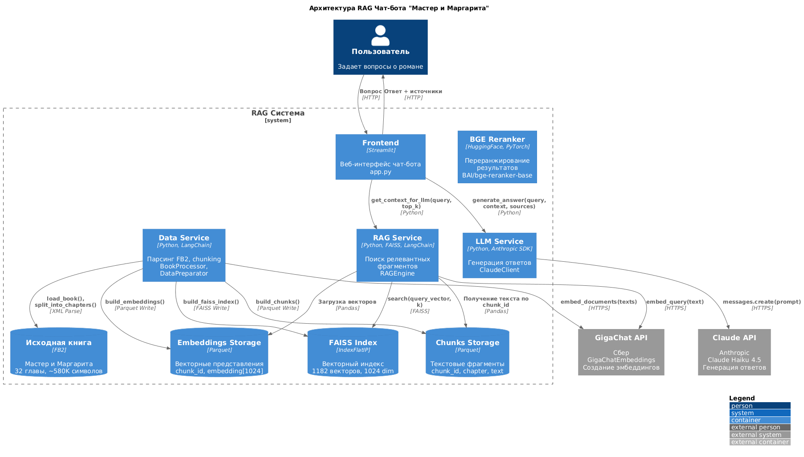
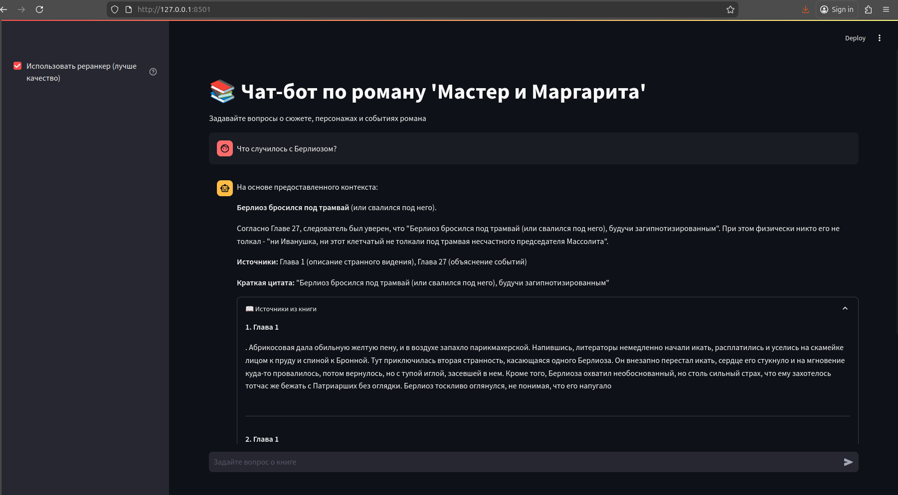

# RAG Чат-бот по роману "Мастер и Маргарита"

Проект для курса "Введение в LLM" - система ответов на вопросы по роману М.А. Булгакова.

## Источник данных

**Книга**: Михаил Булгаков - "Мастер и Маргарита"

**Источник**: [Флибуста](https://flibusta.is/b/813954) (формат FB2)

## Архитектура



## Процесс сбора и подготовки данных

1. **Парсинг FB2** - извлечение текста из XML-структуры
2. **Разбиение на главы** - определение границ глав по заголовкам
3. **Chunking** - разбиение на фрагменты ~800 символов с перекрытием 100 (RecursiveCharacterTextSplitter)
4. **Эмбеддинги** - векторные представления через GigaChatEmbeddings (1024 измерения)
5. **Индексация** - построение FAISS IndexFlatIP для косинусного поиска

## Структура данных

Все данные хранятся в папке [`data/`](data/):

```
data/
├── master_and_margarita.fb2   # Исходная книга
├── chunks.parquet             # Чанки с метаданными
├── chunks_sample.json         # Сэмпл чанков (JSON)
├── chunks_sample.txt          # Сэмпл чанков (текст)
├── embeddings.parquet         # Векторные представления
└── faiss_index/
    └── index.faiss            # Векторный индекс
```

### Формат данных

**chunks.parquet:**
| Поле | Тип | Описание |
|------|-----|----------|
| chunk_id | int64 | ID чанка |
| chapter | int | Номер главы |
| text | string | Текст фрагмента |

**embeddings.parquet:**
| Поле | Тип | Описание |
|------|-----|----------|
| chunk_id | int64 | ID чанка |
| embedding | array[float32] | Вектор 1024 измерения |

## Объем данных

| Метрика | Значение |
|---------|----------|
| Исходный текст | ~580 000 символов |
| Количество глав | 32 + эпилог |
| Количество чанков | 1 182 |

## Сэмпл данных

**Глава 1:**
```
Однажды весною, в час небывало жаркого заката, в Москве, на Патриарших
прудах, появились два гражданина. Первый из них, одетый в летнюю серенькую
пару, был маленького роста, упитан, лыс...
```

**Глава 13:**
```
Маргарита Николаевна со своим мужем вдвоем занимали весь верх прекрасного
особняка в саду в одном из переулков близ Арбата. Очаровательное место!
```

## Быстрый старт

```bash
# Установка зависимостей
pip install -r requirements.txt

# Подготовка данных (если нет готовых)
python main.py

# Запуск интерфейса
streamlit run frontend/app.py
```

Или через Docker:
```bash
docker-compose up frontend
```

### Настройка `.env`

```bash
# LLM провайдер: "openrouter" (по умолчанию) или "claude"
LLM_PROVIDER=openrouter

# OpenRouter (дешевле, по умолчанию)
OPENROUTER_API_KEY=sk-or-v1-...
OPENROUTER_MODEL=openai/gpt-4o-mini

# Claude API (альтернатива)
CLAUDE_API_KEY=sk-ant-api03-...

# GigaChat для эмбеддингов (обязательно)
GIGACHAT_AUTH_KEY=...
```

## Структура репозитория

```
.
├── data/                       # Данные (chunks, embeddings, FAISS index)
├── services/
│   ├── data_service/           # Парсинг FB2, chunking
│   ├── rag_service/            # FAISS + GigaChat Embeddings + BGE Reranker
│   └── llm_service/            # OpenRouter / Claude API
├── frontend/                   # Streamlit UI
├── validation/                 # Оценка качества (RAGAS)
├── metrics/                    # Результаты экспериментов
├── docs/                       # Документация и отчёты
├── main.py                     # Скрипт подготовки данных
└── requirements.txt
```

## Возможности

- **RAG-поиск** — FAISS IndexFlatIP + GigaChat Embeddings (1024 dim)
- **Реранкер** — BGE-reranker-base для улучшения качества (+22% F1)
- **LLM** — OpenRouter (GPT-4o-mini) или Claude Haiku
- **Интерфейс** — Streamlit с историей чата и источниками

## Интерфейс


