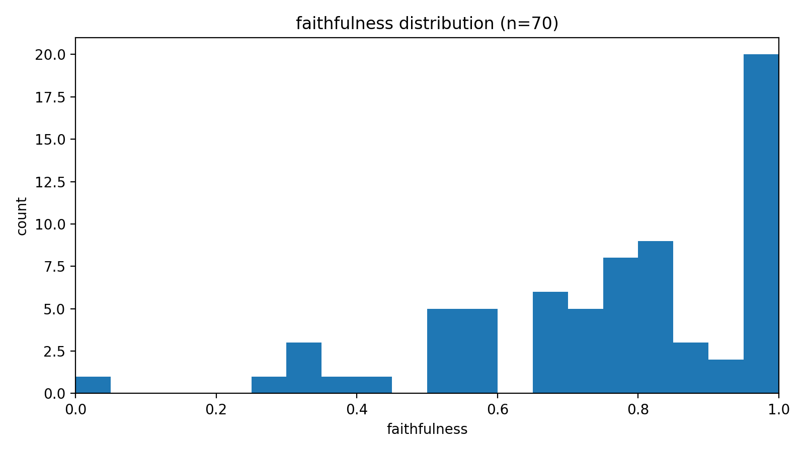
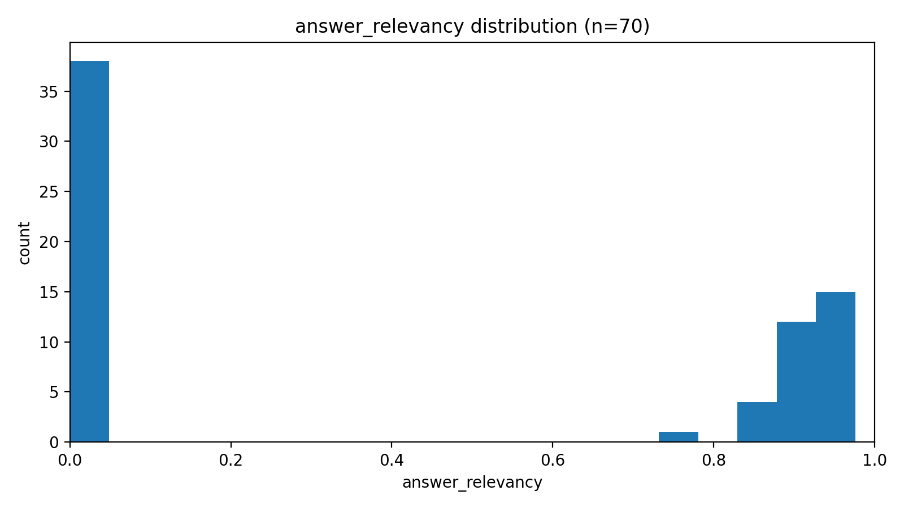
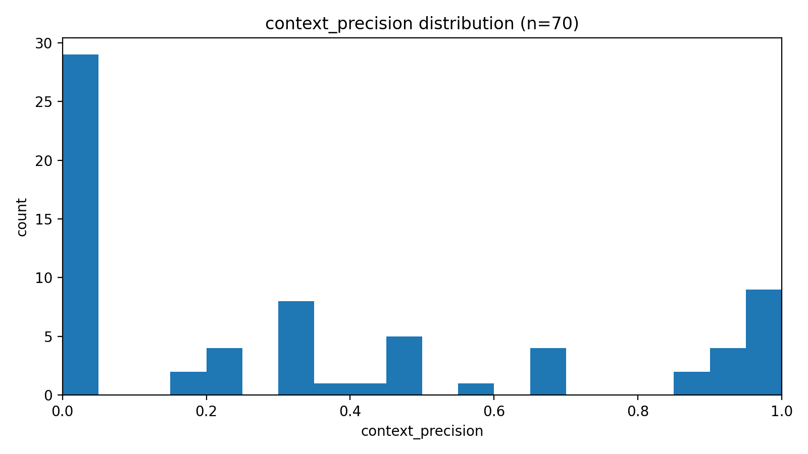
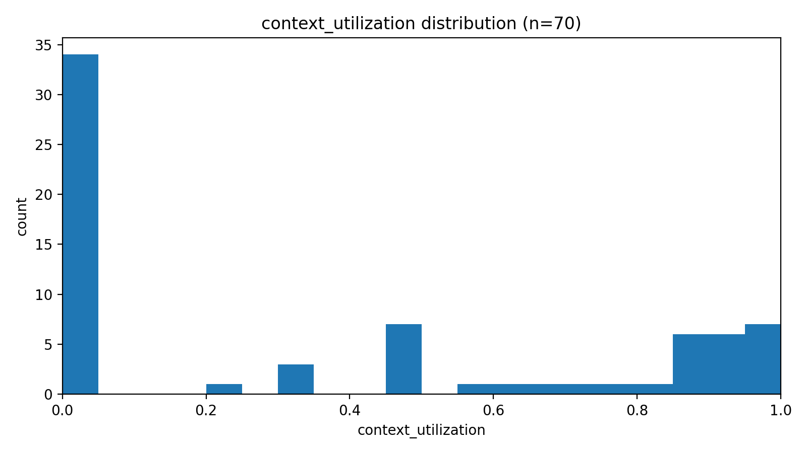
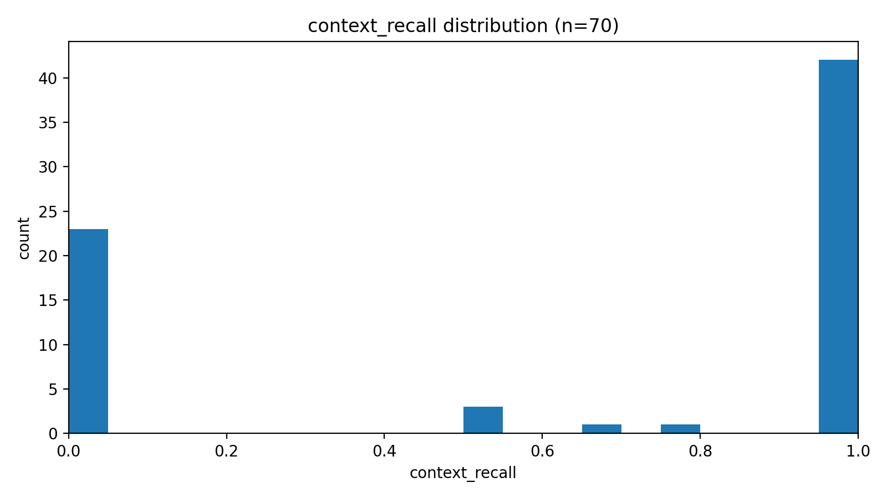
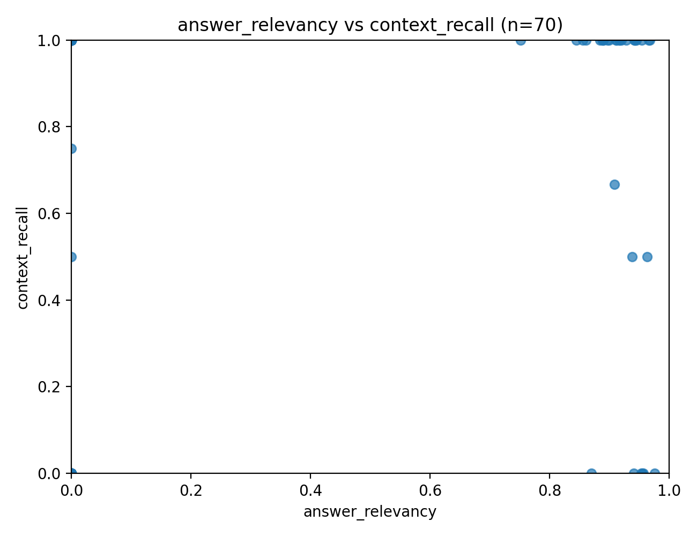
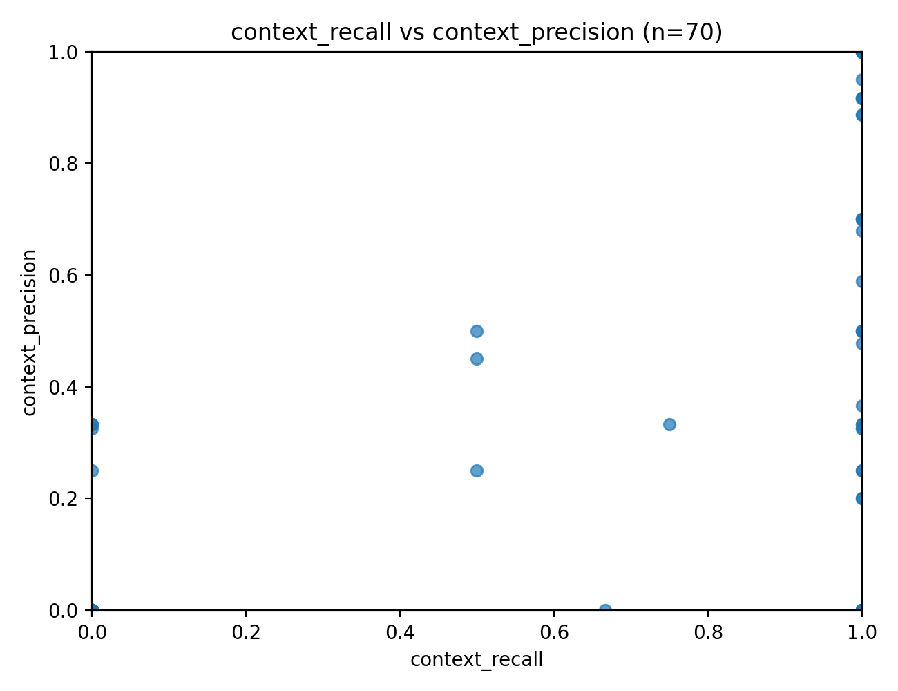
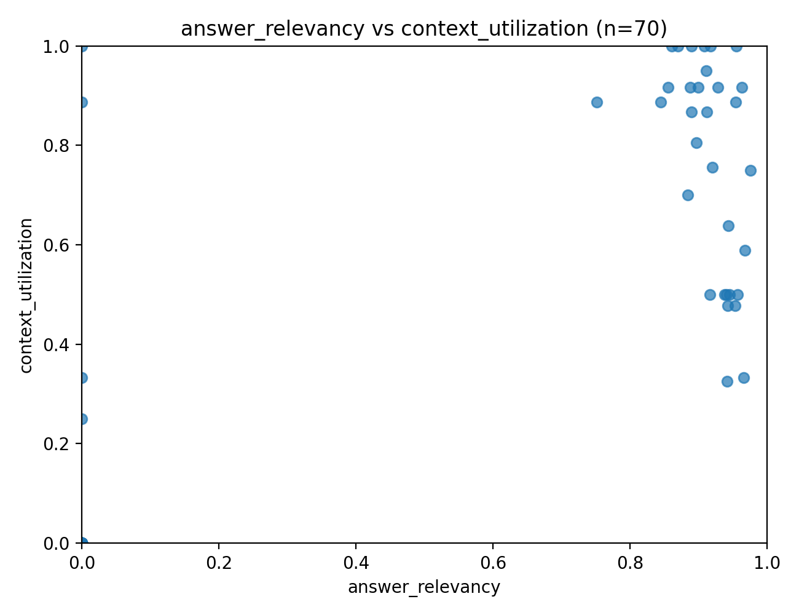
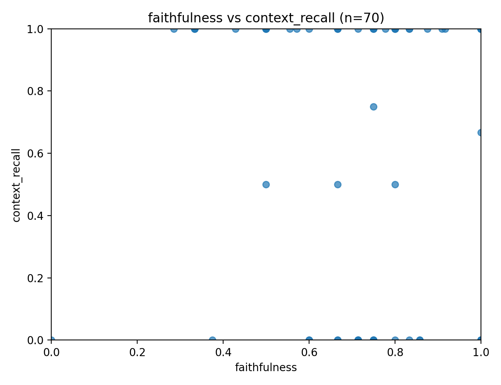

# Отчет по RAG-системе (Claude Haiku 4.5 + GigaChat Embedding)

**LLM (генерация):** `claude-haiku-4-5`  
**Embedding model:** `gigachat embedding`  

---

## 1) Что в датасете

- Всего запросов: **70**
- В каждом запросе поле `contexts` содержит **ровно 5** чанков,
  средний объем контекста ≈ **700** символов.

---

## 2) Метрики, которые есть в CSV

В отчете используются 5 метрик (в диапазоне 0..1):

- **faithfulness** — насколько ответ опирается на предоставленный контекст (меньше галлюцинаций).
- **answer_relevancy** — насколько ответ отвечает на вопрос по сути.
- **context_recall** — насколько retrieval нашел нужную информацию (есть ли ответ в контексте).
- **context_precision** — «чистота» контекста (сколько в нем релевантного к вопросу).
- **context_utilization** — насколько модель *использовала* контекст при построении ответа.

---

## 3) Сводные результаты

| stat | faithfulness | answer_relevancy | context_precision | context_utilization | context_recall |
|---|---|---|---|---|---|
| mean | 0.755 | 0.418 | 0.360 | 0.382 | 0.642 |
| median | 0.764 | 0.000 | 0.287 | 0.287 | 1.000 |
| std | 0.223 | 0.460 | 0.380 | 0.411 | 0.465 |
| min | 0.000 | 0.000 | 0.000 | 0.000 | 0.000 |
| max | 1.000 | 0.976 | 1.000 | 1.000 | 1.000 |

Дополнительно по структуре ошибок:

- **Отказы/«недостаточно контекста»** (по шаблонным фразам в ответе): **31** из 70 (**44.3%**).
- **Полный retrieval (context_recall = 1.0):** 42 запросов.
- **Провал retrieval (context_recall < 0.5):** 23 запросов.
- **Провал генерации при полном retrieval** (context_recall=1 и answer_relevancy<0.2): 19 запросов.
- **Критичный паттерн:** «ответ есть в контексте, но модель отказалась» (context_recall=1 и выявлен отказ): **15** запросов.

---

## 4) Распределения метрик (гистограммы)

---

## 5) Диагностика «где болит»

### 5.1 Retrieval: часто не приносит ответ (низкий context_recall)

- Средний **context_recall = 0.642**, но медиана = **1.000** (при этом много значений ровно 1.0).
- 23 запросов имеют context_recall < 0.5 — значит, ответ не найден или найден слабо.

Примеры запросов с самым низким recall:

| question | context_recall | context_precision | answer_relevancy | faithfulness |
|---|---|---|---|---|
| Кого Иван Бездомный видит в беспокойных снах ночью этого дня? | 0.000 | 0.000 | 0.941 | 1.000 |
| Что велели помощники Воланда Варенухе по телефону? | 0.000 | 0.000 | 0.957 | 0.714 |
| Кто встретил Варенуху в квартире № 50 дома № 302-бис, когда он не послушал данного по телефону совета и был избит двумя… | 0.000 | 0.000 | 0.000 | 0.750 |
| Как разоблачил Коровьев крупного театрального начальника Аркадия Аполлоновича Семплеярова, который порицал «фокус» Вола… | 0.000 | 0.000 | 0.000 | 0.750 |
| На какие деньги писатель Мастер приобрёл отдельный подвальчик из двух комнат, в переулке близ Арбата? | 0.000 | 0.000 | 0.000 | 1.000 |
| Какой доносчик свёл знакомство с Мастером незадолго до его ареста? | 0.000 | 0.000 | 0.000 | 0.857 |
| Почему освобождённый из тюрьмы Мастер не смог вернуться в свой подвальчик? | 0.000 | 0.000 | 0.000 | 0.667 |
| Какую телеграмму из Ялты получили всё в то же памятное утро финдиректор театра Варьете Римский и администратор Варенуха? | 0.000 | 0.325 | 0.954 | 1.000 |
| Кто помог финдиректору Римскому спастись ночью от превращённого в вампира Варенухи и голой девицы с мёртвым лицом, лезш… | 0.000 | 0.000 | 0.000 | 0.714 |
| Что принудило римских солдат побыстрее окончить казнь Иешуа Га-Ноцри и разбойников Гестаса и Дисмаса? | 0.000 | 0.000 | 0.000 | 0.714 |

**Что это обычно означает на практике:**
- недостаточно релевантный поиск (embedding/индекс/чанкинг/порог),
- слишком маленький `k` или слишком «крупные» чанки,
- отсутствуют фильтры/метаданные или наоборот — фильтры режут нужные документы.

### 5.2 Генерация: модель часто «не видит» ответ даже когда он есть

Это главный сигнал по CSV:

- 42 запроса имеют **context_recall=1.0**, но **19** из них — низкая релевантность ответа (answer_relevancy<0.2).
- Из них **15** случаев выглядят как **отказ**, хотя **ground_truth реально присутствует в контексте**.

Топ примеров «ответ есть, но модель отказалась»:

| question | ground_truth_short | context_precision | context_utilization | faithfulness |
|---|---|---|---|---|
| Что проделал кот Бегемот с конферансье Жоржем Бенгальским, который вёл сеанс чёрной магии, устроенный Воландом, в Театр… | По восклицанию из публики: «Голову оторвать этому конферансье» – Бегемот прыгнул на грудь Бенгальскому и сорвал ему гол… | 0.000 | 0.000 | 0.333 |
| На какой московской улице Мастер встретил Маргариту? | На Тверской. | 0.000 | 0.000 | 0.500 |
| За что были арестованы люди, которые приснились Никанору Босому в палате психиатрической клиники? | За хранение валюты. | 0.000 | 0.000 | 0.556 |
| Почему Мастер после освобождения не сообщил о себе Маргарите? | Не зная, где поселиться, и от глубокого горя он добровольно пошёл в клинику Стравинского – и не желал расстраивать Марг… | 0.000 | 0.000 | 0.571 |
| Что сказал Воланд поднесённой ему на балу голове Берлиоза? | «Михаил Александрович... Вы всегда были горячим проповедником той теории, что по отрезании головы жизнь в человеке прек… | 0.000 | 0.000 | 0.667 |
| Кого увидели Мастер и Маргарита на каменистой безрадостной плоской вершине в конце последнего полёта с Воландом и его к… | Понтия Пилата, рядом с которым сидела его верная собака Банга. | 0.000 | 0.000 | 0.667 |
| Что окончательно убедило Берлиоза и Ивана Бездомного в сумасшествии Воланда? | Он уверял их, что сам присутствовал две тысячи лет назад на балконе у Понтия Пилата при его разговоре с Иешуа. | 0.000 | 0.000 | 0.750 |
| Почему Воланд отказался помочь Андрею Фокичу? | Маг указал, что буфетчик и так имеет 249 тысяч рублей сбережений в пяти сберкассах. А жить ему осталось недолго: он умр… | 0.000 | 0.000 | 1.000 |
| Почему собратья по перу связали Ивана Бездомного и отправили его в психиатрическую больницу? | После погони за Воландом и его свитой Иван явился ночью в ресторан Дома Грибоедова в одних кальсонах с иконкой на груди… | 0.200 | 0.000 | 0.714 |
| Как обитатель соседней палаты психиатрической клиники с острым носом и тревожными глазами проник к Ивану Бездомному? | Через балкон. Он стащил у сиделки ключи от балконных решёток и мог тайком перелезать из палаты в палату. | 0.200 | 0.000 | 0.750 |

**Что это обычно означает:**
- промпт/политика ответа излишне «пессимистичная» (модель слишком легко отказывается),
- нет принуждения к *экстракции* (например: «сначала найди цитату/фразу в контексте, потом ответь»),

### 5.3 Сильная сторона: faithfulness относительно высокий

- Средний **faithfulness ≈ 0.755** при очень малой доле нулей (**1.4%**).  
  Это хороший признак: когда модель отвечает содержательно, она в целом не «улетает» в галлюцинации.

---

## Приложение: графики связей метрик

